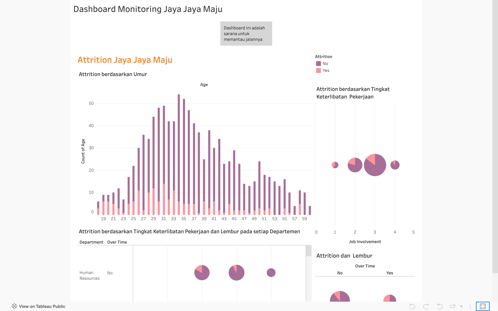

# Proyek Akhir: Menyelesaikan Permasalahan Perusahaan Edutech

## Business Understanding

Jaya Jaya Maju merupakan salah satu perusahaan multinasional yang telah berdiri sejak tahun 2000. Ia memiliki lebih dari 1000 karyawan yang tersebar di seluruh penjuru negeri. 

### Permasalahan Bisnis

Walaupun telah menjadi menjadi perusahaan yang cukup besar, Jaya Jaya Maju masih cukup kesulitan dalam mengelola karyawan. Hal ini berimbas tingginya attrition rate (rasio jumlah karyawan yang keluar dengan total karyawan keseluruhan) hingga lebih dari 10%.

Untuk mencegah hal ini semakin parah, proyek ini berguna untuk mengidentifikasi berbagai faktor yang mempengaruhi tingginya attrition rate tersebut. Selain itu, terdapat <i>business dashboard</i> guna melakukan monitor pada faktor-faktor tersebut. 

### Cakupan Proyek

1. Identifikasi faktor penyebab <i>attrition</i>. Departemen HR akan mendapatkan informasi mengenai faktor-faktor yang mempengaruhi <i>attrition</i> dan akan mendapatkan rekomendasi terkait langkah-langkah yang sebaiknya dilakukan
2. Menyediakan model yang dapat memprediksi apakah seorang pegawai akan meninggalkan perusahaan atau tidak (<i>Attrition</i>). Model akan menjadi model klasifikasi yang dapat menerima data baru terkait pegawai.
3. Mengevaluasi model yang dibuat melalui pemisahan data <i>train</i> dan <i>test</i>
4. Menyediakan <i>business dashboard</i> yang akan diisi oleh data-data yang merupakan faktor penting terkait <i>Attrition</i>.


### Persiapan

Sumber data: <a href = 'https://github.com/dicodingacademy/dicoding_dataset/blob/main/employee/employee_data.csv'>link data</a>

Setup environment:

```
conda create --name main-ds python=3.9
conda activate main-ds
pip install -r requirements.txt
jupyter notebook
python prediciton.py

```

## Business Dashboard

<i>business dashboard</i> yang dibuat merupakan <i>business dashboard</i> yang diimplementasikan pada Tableau Public. Faktor yang ditampilkan bagi HR untuk dapat memonitor perusahaan adalah faktor umur, jenis departemen, dan keterlibatan lembur serta pekerjaan. Dashboard dapat diakses melalui: <a href = 'https://public.tableau.com/app/profile/louis.widi.anandaputra/viz/EmployeeAttrition_17165138505350/Story1#1'>link
<br></a>


## Conclusion

1. Tenure. Pekerja yang sudah lama di perusahaan (kecuali pensiun) cenderung tidak akan meninggalkan pekerjaan. Hal ini juga berkaitan dengan faktor selanjutnya.
2. Demografi. Pekerja yang berumur muda akan cenderung meninggalkan perusahaan dan berkaitan erat dengan mereka yang belum menikah. Hal ini menjadi dugaan bahwa pekerja yang meninggalkan perusahaan adalah mereka yang tidak memiliki tanggungan besar.
3. Jenis Pekerjaan dan Pendapatan. Pekerja dengan <i>entry level role</i> cenderung memiliki nilai pendapatan yang lebih rendah. Jenis pekerjaan seperti <i>sales</i> dan <i>laboratory technician</i> akan memiliki pendapatan yang lebih rendah dibandingkan peran lain yang menjadi salah satu faktor <i>attrition</i>.
4. Keterlibatan Pekerjaan. Pekerja yang memiliki keterlibatan rendah lebih mungkin untuk meninggalkan perusahaan, terutama mereka yang terlibat dalam lembur.
   
### Rekomendasi Action Items (Optional)

- Memastikan lingkungan yang kondusif bagi para pekerja, terutama ketika lembur. Hal ini menjadi catatan penting agar para pekerja yang lembur tidak merasa terbebani, terutama bagi mereka yang baru saja masuk perusahaan. Departemen HR juga dapat memberikan informasi tambahan di waktu yang akan datang karena pada saat ini hanya terdapat informasi mengenai apakah pegawai menjalankan lembur atau tidak. 
- Memberikan <i>coaching</i> yang lebih baik terhadap pekerja yang baru masuk, terutama mereka yang berumur muda agar memiliki <i>sense of belonging</i>. Hal ini akan berkaitan dengan kenyamanan untuk bekerja di perusahaan dan akan berkaitan dengan rekomendasi selanjutnya, yakni untuk mememberi apresiasi kepada para pegawai. Tentu, sistem ini harus dijalankan mulai dari tingkat pekerja <i>entry level</i> hingga tingkat paling atas.
- Membuat sistem bonus yang membuat para pekerja merasa dihargai, serta memberikan sistem dimana semua pekerja dapat memiliki keterlibatan yang sama. Hal ini berkaitan dengan fakta bahwa pekerja yang memiliki sedikit keterlibatan dalam pekerjaan mereka cenderung akan meninggalkan perusahaan, persuahaan dapat membuat sistem bonus yang memberikan apresiasi yang baik bagi para pegawai dan membuat sistem dimana keterlibatan akan teredistribusi secara merata.
